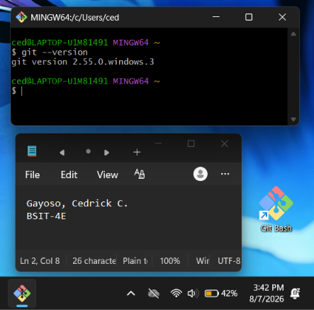
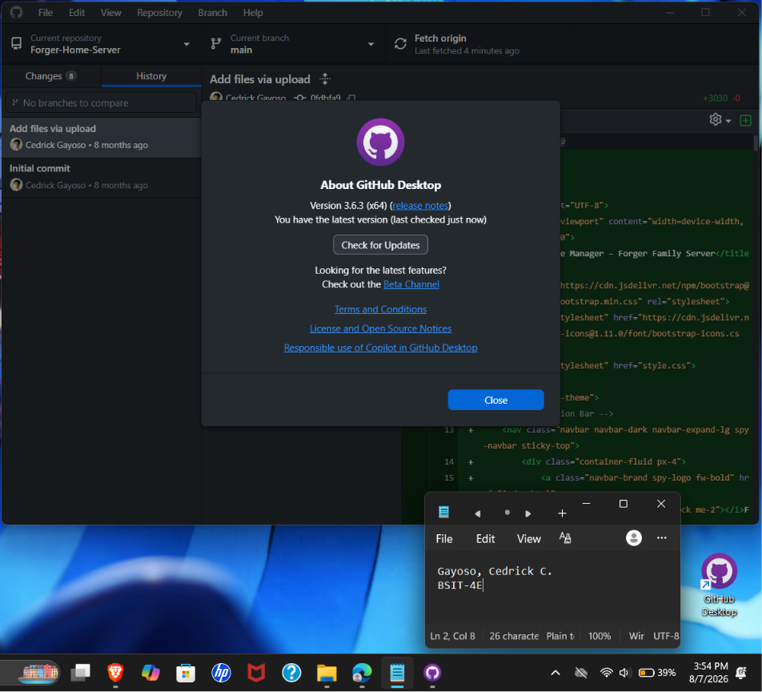
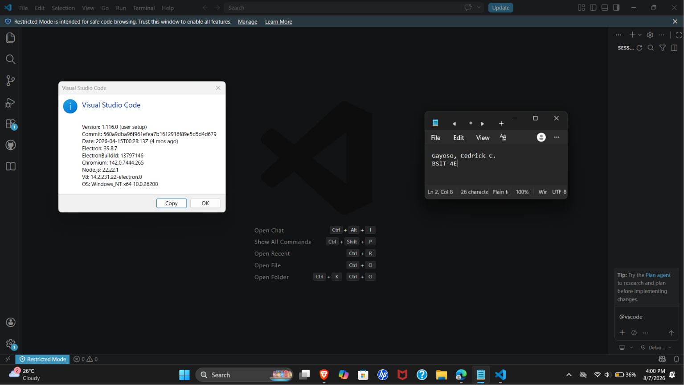
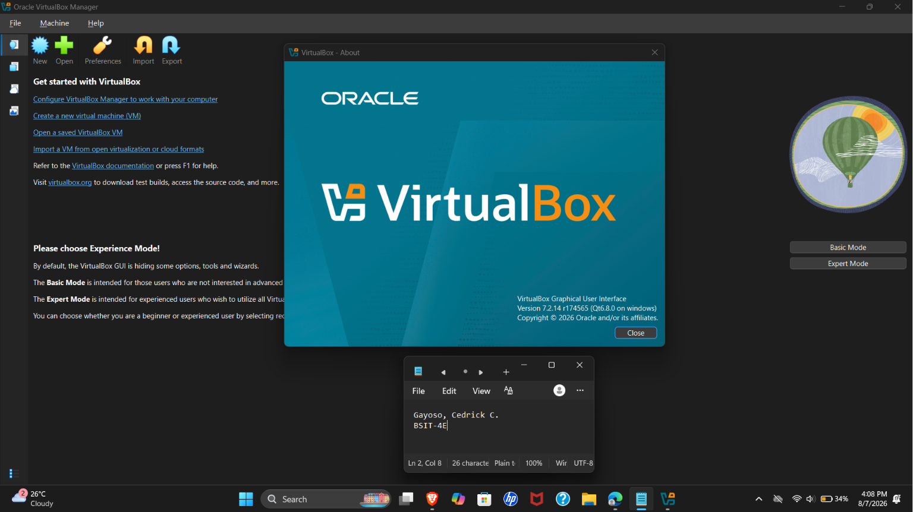
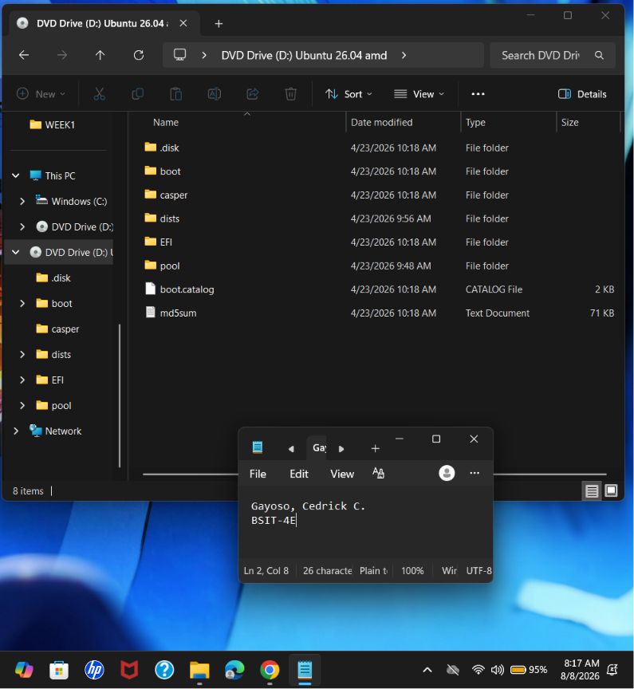
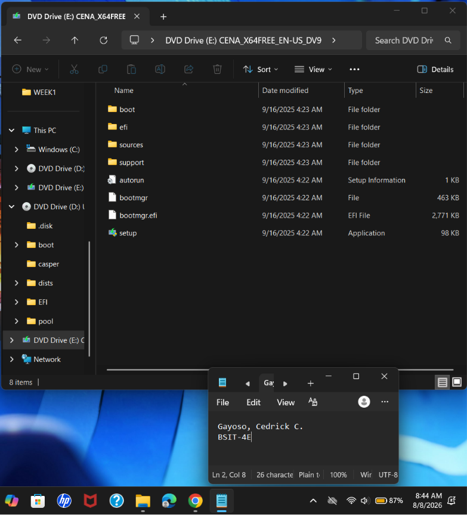

# Week 1 – Building My Professional Environment

## Student Information

* **Name:** Cedrick Capili Gayoso
* **Course:** Bachelor of Science in Information Technology (BSIT)
* **Section:** BSIT-4E
* **Date:** August 8, 2026

---

# Objectives

The objectives of this activity are to:

* Become familiar with basic IT tools and software.
* Learn the basic purpose of Git and GitHub.
* Learn how GitHub Desktop is used to manage repositories.
* Become familiar with Visual Studio Code as a code editor.
* Learn the basic purpose of VirtualBox and virtual machines.
* Understand what Ubuntu and Windows ISO files are used for.
* Set up the necessary tools for future IT activities and projects.
* Begin building my professional accounts and online presence.

---

# Software Installed

The following software and installation files were installed or prepared during the activity:

* **Git** – A version control software that will be used to manage changes in project files.
* **GitHub Desktop** – An application that provides a graphical way to work with Git and GitHub.
* **Visual Studio Code (VS Code)** – A code editor that can be used to create and edit programming files.
* **VirtualBox** – Software used to create and run virtual machines.
* **Ubuntu ISO** – An installation file used to install the Ubuntu operating system.
* **Windows ISO** – An installation file used to install the Windows operating system.

---

# Professional Accounts

* **GitHub:** https://github.com/ozuya
* **LinkedIn:** https://www.linkedin.com/in/gayoso-cedrick/

---

# Installation Screenshots

The following screenshots show the installation and setup of the software and professional accounts.

### Git Installation

### GitHub Desktop

### Visual Studio Code

### VirtualBox

### Ubuntu ISO

### Windows ISO

### GitHub Profile

**GitHub:** [https://github.com/ozuya](https://github.com/ozuya)

### LinkedIn Profile

**LinkedIn:**[https://www.linkedin.com/in/gayoso-cedrick/](https://www.linkedin.com/in/gayoso-cedrick/)

---

# Challenges Encountered

## 1. Learning What Each Software Does

Since I had no prior knowledge of the software used in this activity, one of my first challenges was understanding the purpose of Git, GitHub Desktop, VS Code, and VirtualBox. At first, I was unfamiliar with how these tools were related to IT development and system administration.

**Solution:**
I researched the basic purpose of each software and followed the provided instructions and learning materials. This helped me understand what each tool is used for and why it is important for IT students.

## 2. Understanding Git and GitHub

Another challenge was understanding the difference between Git and GitHub. I initially did not know that Git is a version control system while GitHub is an online platform used to store and collaborate on Git repositories.

**Solution:**
I studied the basic concepts of Git and GitHub and practiced creating and managing a repository. This gave me a better understanding of how version control can be used in projects.

## 3. Understanding Virtual Machines and ISO Files

I also had difficulty understanding VirtualBox, virtual machines, and ISO files because I had not used them before. I initially did not know how an ISO file is related to installing an operating system in a virtual machine.

**Solution:**
I learned that VirtualBox can create a virtual computer inside my actual computer, while an ISO file contains the installation files needed to install an operating system. I followed the installation instructions to prepare Ubuntu and Windows for future virtual machine activities.

---

# Reflection

During this activity, I was able to set up some of the software that we will be using for our IT activities. I already had some basic knowledge of VS Code and GitHub Desktop, so I was more familiar with those compared to the other software. However, I had not used or studied Git, VirtualBox, Ubuntu, and Windows ISO files in detail yet.

One of the things I realized from this activity is that setting up the right tools is an important part of preparing for future IT work. Even though we have not learned how to use all of the software yet, installing and preparing them gave me an idea of what we will be working with in the next activities. I am especially interested in learning more about VirtualBox and the operating systems because they seem useful for practicing different IT tasks.

I think these tools will be helpful for my development as a future System Administrator. VirtualBox and the Ubuntu and Windows ISO files can give me an environment where I can eventually practice working with different operating systems. Git and GitHub Desktop can also be useful for managing files and projects once we start using them more.

This activity was mainly about preparing my professional environment and becoming familiar with the tools that we will use. I still have a lot to learn about them, but I now know what software I will be working with and I am looking forward to learning how to use them properly in the next activities.

---

# References

* Git. (n.d.). *Downloads*. https://git-scm.com/downloads
* GitHub. (n.d.). *GitHub Desktop*. https://desktop.github.com/
* Microsoft. (n.d.). *Visual Studio Code*. https://code.visualstudio.com/download
* Oracle. (n.d.). *Oracle VM VirtualBox*. https://www.virtualbox.org/wiki/Downloads
* Ubuntu. (n.d.). *Download Ubuntu Desktop*. https://ubuntu.com/download/desktop
* Microsoft. (n.d.). *Download Windows 11*. https://www.microsoft.com/software-download/windows11
