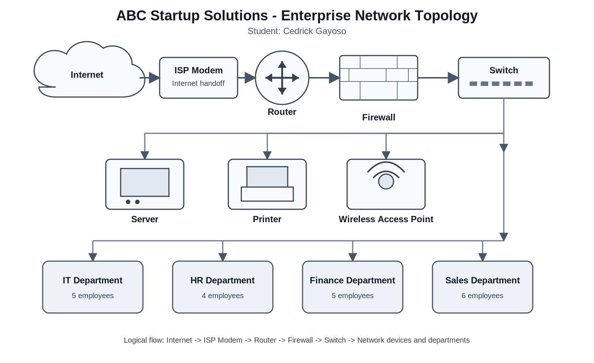

# Week 2 - Enterprise Infrastructure Planning for a Startup Company

## Project Overview
Every successful IT infrastructure begins with proper planning. This Week 2 project prepares an initial IT Infrastructure Plan for **ABC Startup Solutions**, a newly established software development company with 20 employees on a single office floor. The activity covers company planning, hardware, software, networking, a network topology, system administration roles, infrastructure recommendations, and reflection.

## Learning Objectives
### Knowledge
- Explain the roles and responsibilities of a System Administrator.
- Identify the hardware, software, and networking requirements of a small business.
- Describe the purpose of IT documentation and infrastructure planning.

### Skills
- Analyze organizational IT requirements.
- Prepare professional IT inventories.
- Design an enterprise network topology.
- Create technical documentation using Markdown.
- Present infrastructure planning professionally.

### Attitude
- Professionalism
- Organization
- Technical communication
- Attention to detail
- Critical thinking

## Company Scenario
ABC Startup Solutions is a newly established software development company with 20 employees on one office floor.

| Department | Employees |
|---|---:|
| Information Technology | 5 |
| Human Resources | 4 |
| Finance | 5 |
| Sales | 6 |
| **Total** | **20** |

At the start of the activity, the company has no computers, no server, no network, no internet infrastructure, and no security policies.

## Hardware Inventory Summary
| Hardware | Quantity | Main Use |
|---|---:|---|
| Desktop Computers | 9 | HR and Finance workstations |
| Laptops | 11 | IT and Sales workstations |
| Server | 1 | Centralized services |
| Router | 1 | Network routing |
| Switch | 1 | Wired network connections |
| Printer | 2 | Shared printing and scanning |
| UPS | 2 | Backup power for important equipment |
| Wireless Access Point | 2 | Office wireless coverage |
| NAS Storage | 1 | Shared storage and local backups |
| External Backup Drive | 2 | Separate backup copies |
| Monitors | 20 | Employee displays |

## Software Inventory Summary
| Software | Purpose |
|---|---|
| Windows 11 Pro | Employee workstation operating system |
| Ubuntu Server | Server operating system |
| Microsoft Office | Business documents and office work |
| VS Code | Code editing |
| Git | Version control |
| GitHub Desktop | Graphical Git and GitHub workflow |
| VirtualBox | Virtual machines and testing |
| Google Chrome | Web access and web applications |
| Microsoft Defender | Antivirus and malware protection |
| AnyDesk | Authorized remote support |
| 7-Zip | File compression and extraction |

## Embedded Network Diagram

The diagram includes the Internet, ISP Modem, Router, Firewall, Switch, Wireless Access Point, Server, Printer, and the IT, HR, Finance, and Sales departments.

## Technologies Used
- Windows 11 Pro
- Ubuntu Server
- Microsoft Office
- VS Code
- Git
- GitHub Desktop
- VirtualBox
- Google Chrome
- Microsoft Defender
- AnyDesk
- 7-Zip
- Draw.io
- Markdown

## Challenges Encountered
The most challenging task was designing the enterprise network diagram because the required devices and departments had to be connected in a logical order and labeled clearly. Organizing the inventories was also important because each item needed a realistic quantity and a clear purpose.

## Reflection
This activity showed me that system administration begins with understanding business requirements before deployment. I learned how employee distribution affects hardware, software, networking, backup, and security planning. I also learned that clear documentation makes technical decisions easier to understand and maintain.

## References

- Cisco. [CCNA Certification](https://www.cisco.com/site/us/en/learn/training-certifications/exams/ccna.html)
- Red Hat. [Red Hat Certified System Administrator (RHCSA)](https://www.redhat.com/en/services/certification/rhcsa)
- Amazon Web Services. [AWS Certified Cloud Practitioner](https://aws.amazon.com/certification/certified-cloud-practitioner/)
- Microsoft Learn. [Microsoft 365 Certified: Endpoint Administrator Associate](https://learn.microsoft.com/en-us/credentials/certifications/modern-desktop/)
- National Institute of Standards and Technology. [SP 800-63B: Authentication and Authenticator Management](https://pages.nist.gov/800-63-4/sp800-63b.html)
- Cybersecurity and Infrastructure Security Agency. [Require Multifactor Authentication](https://www.cisa.gov/audiences/small-and-medium-businesses/secure-your-business/require-multifactor-authentication)
- Cybersecurity and Infrastructure Security Agency. [Back Up Business Data](https://www.cisa.gov/audiences/small-and-medium-businesses/secure-your-business/back-up-business-data)
- Canonical. [Ubuntu Server Documentation](https://ubuntu.com/server/docs/)
- Microsoft Learn. [Microsoft Defender Antivirus in Windows Overview](https://learn.microsoft.com/en-us/defender-endpoint/microsoft-defender-antivirus-windows)
