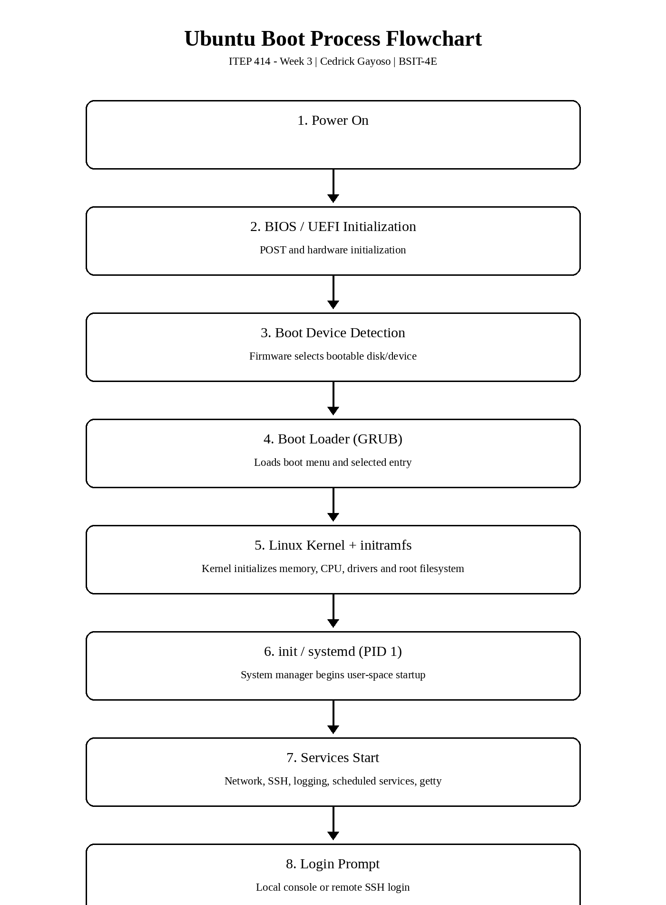

# Week 03 - Enterprise Server Deployment and Operating System Installation

**Student:** Cedrick Gayoso  
**Program:** Bachelor of Science in Information Technology (BSIT)  
**Course:** ITEP 414 - System Administration and Maintenance  
**Section:** BSIT-4E  
**Week:** 3  
**Project Type:** Individual Portfolio Project  
**Project Title:** Enterprise Server Deployment and Operating System Installation  

## Project Overview
This Week 3 portfolio project follows the role described in the course module: a Junior System Administrator at **ABC Startup Solutions** deploying the company's first Linux server. The Ubuntu Server will serve as a baseline for future file sharing, remote administration, database hosting, web hosting, and internal services. The work includes Ubuntu Server installation, required configuration, post-installation verification, BIOS and UEFI comparison, an Ubuntu boot-process flowchart, a Windows Server Evaluation bring-home activity, operating-system comparison, and professional technical documentation.

## Learning Objectives
- Explain the purpose of an operating system in enterprise environments.
- Differentiate BIOS and UEFI firmware.
- Explain the stages of the computer boot process.
- Compare Ubuntu Server, Windows Server, and Rocky Linux.
- Install Ubuntu Server in a virtual machine.
- Configure server settings during installation.
- Enable secure remote administration using SSH.
- Verify server functionality.
- Document installation procedures and produce professional technical documentation.

## Software Requirements
- Oracle VirtualBox or VMware Workstation
- Ubuntu Server LTS ISO - latest stable version
- Windows Server Evaluation ISO for the bring-home activity

## Virtual Machine Specifications
| Component | Required Configuration |
|---|---|
| Name | `Ubuntu-Server-Week03` |
| RAM | 4 GB |
| CPU | 2 virtual processors |
| Storage | 40 GB VDI/VMDK |
| Network | NAT, or Bridged if instructed |
| Optical Drive | Ubuntu Server ISO |
| Language | English |
| Keyboard | Appropriate layout, e.g. English (US) |
| Network configuration | DHCP unless instructed otherwise |
| Hostname | `server01` |
| Administrative user | `gayoso` - based on the module's example of using the student's last name; verify this matches the actual VM |
| Disk method | Guided - Use Entire Disk |
| SSH | Install OpenSSH Server |
| Additional packages | None unless instructed |

## Installation Summary
1. Create a VM named `Ubuntu-Server-Week03` with 4 GB RAM, 2 virtual processors, and a 40 GB virtual disk.
2. Attach the Ubuntu Server LTS ISO and start the installation.
3. Select English and the appropriate keyboard layout.
4. Accept DHCP unless another network configuration is specifically required, and record the assigned IP address.
5. Set the hostname to `server01`.
6. Create a non-root administrative user. For this portfolio, the documented username is `gayoso`; the actual VM should use the username entered during installation.
7. Select **Guided - Use Entire Disk** and record the partition scheme, filesystem, and disk size shown by the installer.
8. Enable **Install OpenSSH Server**.
9. Do not install additional packages unless instructed.
10. Complete the installation, reboot, and remove the installation ISO if prompted.

## Configuration Summary
- Hostname: `server01`
- User: Cedrick Gayoso / documented username `gayoso`
- Network: DHCP unless instructed otherwise
- IP address: must be recorded from the actual VM; the project brief does not provide a fixed address
- Disk: 40 GB, Guided - Use Entire Disk
- Partition scheme and filesystem: record the actual values shown by the installer
- SSH: OpenSSH Server enabled during installation
- Additional packages: none unless instructed

## Verification Results
The module requires the following verification commands and screenshots. Values that depend on the actual VM cannot be supplied by the assignment PDF and must be captured during the lab.

| Verification | Command | Required Evidence / Expected Value |
|---|---|---|
| Login | Local login | Screenshot of successful login using the created account |
| Hostname | `hostname` | `server01` |
| IP address | `ip addr` | Screenshot showing the DHCP-assigned IP address |
| Internet connectivity | `ping -c 4 google.com` | Screenshot showing successful replies |
| System update | `sudo apt update` then `sudo apt upgrade -y` | Screenshot showing the update process |
| SSH service | `systemctl status ssh` | Service should show `active (running)` |

## BIOS vs UEFI Highlights
The project requires a comparison covering definition, boot process, maximum disk support, partition style, security features, speed, advantages, disadvantages, and modern usage. In general, BIOS represents the older firmware approach, while UEFI provides a newer firmware architecture with modern boot management and security capabilities. The full comparison and one-page explanation are provided in `BIOS_vs_UEFI.pdf`.

## Ubuntu Boot Process Flowchart

Required sequence:

**Power On -> BIOS/UEFI Initialization -> Boot Device Detection -> Boot Loader (GRUB) -> Linux Kernel -> init/systemd -> Services Start -> Login Prompt**

The flowchart is exported as both `BootProcessFlowchart.pdf` and `diagrams/BootProcessFlowchart.png`.

## Windows Server Installation Summary
The bring-home activity requires a separate Windows Server Evaluation virtual machine. The minimum tasks are to install the operating system, assign a computer name, create an Administrator password, log in successfully, and capture installation screenshots.

**Computer name:** Not specified by the Week 3 module; record the name actually assigned during installation.  
**Password:** Do not place the Administrator password in this repository.  
**Evidence:** Actual Windows Server installation and login screenshots are required and cannot be derived from the assignment PDF.

## Operating System Comparison
The module requires comparison of **Windows Server**, **Ubuntu Server**, and **Rocky Linux** across licensing, user interface, package management, security, performance, typical enterprise use cases, advantages, and disadvantages. The comparative table and discussion are provided in `OS_Comparison.pdf`.

## Challenges Encountered
The assignment requires students to document real problems encountered and solutions implemented. Because no VM screenshots, logs, or lab notes were included with the source files, this package does not invent problems. Record only issues that actually occurred during installation or verification.

Examples of categories to document if they occur include boot-media removal, DHCP/network access, package updates, SSH service status, or virtual-machine settings.

## Reflection
This Week 3 project shows that deploying a server is more than simply installing an operating system. A server must be configured in a consistent way, verified with repeatable commands, secured for remote administration, and documented so another administrator can reproduce the work. The project scenario for ABC Startup Solutions makes that responsibility clear because the Ubuntu Server will later support services such as file sharing, remote administration, database hosting, web hosting, and internal services.

The installation requirements also demonstrate the importance of establishing a baseline. The virtual machine name, 4 GB of RAM, two virtual processors, 40 GB of storage, network mode, hostname `server01`, non-root administrative user, disk configuration, and OpenSSH selection are not isolated settings. Together, they define how the server will be identified, accessed, maintained, and expanded later. The requirement to avoid unnecessary additional packages also reinforces the value of starting with a controlled configuration.

The verification stage is especially useful because it turns configuration into evidence. The `hostname` command confirms the server identity, `ip addr` confirms network addressing, `ping -c 4 google.com` checks connectivity, the APT update and upgrade commands confirm package maintenance, and `systemctl status ssh` verifies that secure remote administration is available. Capturing screenshots of these checks creates a record that can be reviewed by an instructor or another administrator.

The BIOS-versus-UEFI comparison and boot-process flowchart add another layer of understanding. Following the sequence from power-on, through firmware initialization and boot-device detection, to GRUB, the Linux kernel, systemd, service startup, and finally the login prompt provides a structured way to reason about boot problems. Comparing Windows Server, Ubuntu Server, and Rocky Linux also emphasizes that enterprise operating systems should be evaluated according to requirements such as licensing, administration model, security, performance, and intended use rather than by familiarity alone.

Overall, the project connects installation, verification, troubleshooting, documentation, and professional portfolio work. It reinforces the idea that a system administrator should be able not only to deploy a server, but also to explain what was configured, prove that it works, and leave clear documentation for the next person who maintains it.

## References
- Ubuntu Server documentation, for implementation details used during the actual Ubuntu installation.
- Microsoft Windows Server documentation, for the Windows Server Evaluation activity.
- Rocky Linux documentation, for the operating-system comparison.
- UEFI specifications/documentation, for firmware and boot-process research.
